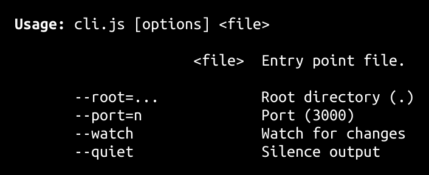

<h1>
devito <a href="https://npmjs.org/package/devito"></a> <a href="src"></a> <a href="LICENSE"></a>
</h1>

<p></p>

Fast http/2 web dev server

<h4>
<table><tr><td title="Triple click to select and copy paste">
<code>npm i devito -g</code>
</td><td title="Triple click to select and copy paste">
<code>pnpm add devito -g</code>
</td><td title="Triple click to select and copy paste">
<code>yarn global add devito</code>
</td></tr></table>
</h4>

## CLI

<p></p>
<p>

</p>

devito is a fast web dev server, inspired by [vite](https://vitejs.dev/).

It also uses [esbuild](https://esbuild.github.io/).

```sh
devito my-file.tsx
```

The above will serve `my-file.tsx` and will refresh on every change.

## Open in editor

Allows opening `file[:line[:col]]` links from the DevTools console output, right into your editor. Use `--editor=<editor>` to set your own (defaults to `code`).

> [Get the Chrome DevTools extension.](https://github.com/generalov/open-in-editor-extension)

> [See the supported editors](https://github.com/generalov/open-in-editor#options).

## import.meta.url

`import.meta.url` is transformed to `<location.origin>/@fs/<path>`.

The relative base path `/@fs/` is computed with `--homedir=<path>`. It defaults to `os.homedir()`.

## Workers/Worklets/iframe

```ts
// Worker
new Worker(new URL('./my-worker.js', import.meta.url).href, { type: 'module' })

// AudioWorklet
audioContext.audioWorklet.addModule(
  new URL('./my-audio-worklet.js', import.meta.url).href
)

// iframe
const src = new URL('sandbox-iframe.js', import.meta.url).href
iframe.srcdoc = `<script src="${src}" type="module"></script>`
```

## CSS

```ts
import 'some.css'
```

Statically bundled modules will bundle all css to `bundle.css`.

Dynamically discovered modules (such when using `import()`) will create a `<style>`
element and it'll be appended in `<head>`.

## JSON

```ts
import json from 'some.json'
```

## JSX

```ts
// @jsxImportSource jsx-lib
```

`tsconfig.json`:

```json
"compilerOptions": {
  ...
  "jsx": "react-jsx",
  ...
}
```

## Markdown

```sh
devito README.md
```

## Caching ~ Certificate

To enable browser caching in order to get all the speed benefits, you'll need to create a certificate.

devito will try to find a cert+key for `devito.test` under
`process.env.SSL_CERTS_DEVITO`, `~/.ssl-certs/` or using `--cert=xxx` (minus the `-key.pem` and `.pem` suffixes).

### Make certificate:

```sh
mkcert -install
mkcert devito.test
cp devito.test* ~/.ssl-certs/
```

Then add an entry `127.0.0.1 devito.test` in `/etc/hosts`.

Chrome/Firefox should now cache assets properly for that location.

> More info here: https://jonathanbossenger.com/2019/02/08/setting-up-trusted-ssl-certificates-for-local-development-using-mkcert-on-ubuntu-18-04-with-apache/

## API

<p>  <details id="DevitoOptions$80" title="Class" ><summary><span><a href="#DevitoOptions$80">#</a></span>  <code><strong>DevitoOptions</strong></code>    </summary>  <a href="src/devito.ts#L19">src/devito.ts#L19</a>  <ul>        <p>  <details id="constructor$81" title="Constructor" ><summary><span><a href="#constructor$81">#</a></span>  <code><strong>constructor</strong></code><em>(options)</em>    </summary>  <a href="src/devito.ts#L47">src/devito.ts#L47</a>  <ul>    <p>  <details id="new DevitoOptions$82" title="ConstructorSignature" ><summary><span><a href="#new DevitoOptions$82">#</a></span>  <code><strong>new DevitoOptions</strong></code><em>()</em>    </summary>    <ul><p><a href="#DevitoOptions$80">DevitoOptions</a></p>      <p>  <details id="options$83" title="Parameter" ><summary><span><a href="#options$83">#</a></span>  <code><strong>options</strong></code>  <span><span>&nbsp;=&nbsp;</span>  <code>{}</code></span>  </summary>    <ul><p><span>Partial</span>&lt;<a href="#DevitoOptions$80">DevitoOptions</a>&gt;</p>        </ul></details></p>  </ul></details></p>    </ul></details><details id="alias$100" title="Property" ><summary><span><a href="#alias$100">#</a></span>  <code><strong>alias</strong></code>    </summary>  <a href="src/devito.ts#L43">src/devito.ts#L43</a>  <ul><p><span>Record</span>&lt;string, string&gt;</p>        </ul></details><details id="bundle$92" title="Property" ><summary><span><a href="#bundle$92">#</a></span>  <code><strong>bundle</strong></code>  <span><span>&nbsp;=&nbsp;</span>  <code>true</code></span>  </summary>  <a href="src/devito.ts#L33">src/devito.ts#L33</a>  <ul><p>boolean</p>        </ul></details><details id="cache$94" title="Property" ><summary><span><a href="#cache$94">#</a></span>  <code><strong>cache</strong></code>  <span><span>&nbsp;=&nbsp;</span>  <code>true</code></span>  </summary>  <a href="src/devito.ts#L35">src/devito.ts#L35</a>  <ul><p>boolean</p>        </ul></details><details id="cert$89" title="Property" ><summary><span><a href="#cert$89">#</a></span>  <code><strong>cert</strong></code>  <span><span>&nbsp;=&nbsp;</span>  <code>...</code></span>  </summary>  <a href="src/devito.ts#L25">src/devito.ts#L25</a>  <ul><p>string | <span>ServerOptions</span></p>        </ul></details><details id="editor$91" title="Property" ><summary><span><a href="#editor$91">#</a></span>  <code><strong>editor</strong></code>  <span><span>&nbsp;=&nbsp;</span>  <code>'code'</code></span>  </summary>  <a href="src/devito.ts#L32">src/devito.ts#L32</a>  <ul><p>string</p>        </ul></details><details id="entryResolveDir$99" title="Property" ><summary><span><a href="#entryResolveDir$99">#</a></span>  <code><strong>entryResolveDir</strong></code>    </summary>  <a href="src/devito.ts#L41">src/devito.ts#L41</a>  <ul><p>string</p>        </ul></details><details id="entrySource$98" title="Property" ><summary><span><a href="#entrySource$98">#</a></span>  <code><strong>entrySource</strong></code>    </summary>  <a href="src/devito.ts#L40">src/devito.ts#L40</a>  <ul><p>string</p>        </ul></details><details id="extraAnalyzePaths$101" title="Property" ><summary><span><a href="#extraAnalyzePaths$101">#</a></span>  <code><strong>extraAnalyzePaths</strong></code>  <span><span>&nbsp;=&nbsp;</span>  <code>[]</code></span>  </summary>  <a href="src/devito.ts#L45">src/devito.ts#L45</a>  <ul><p>string  []</p>        </ul></details><details id="file$84" title="Property" ><summary><span><a href="#file$84">#</a></span>  <code><strong>file</strong></code>    </summary>  <a href="src/devito.ts#L20">src/devito.ts#L20</a>  <ul><p>string</p>        </ul></details><details id="homedir$90" title="Property" ><summary><span><a href="#homedir$90">#</a></span>  <code><strong>homedir</strong></code>  <span><span>&nbsp;=&nbsp;</span>  <code>'~'</code></span>  </summary>  <a href="src/devito.ts#L31">src/devito.ts#L31</a>  <ul><p>string</p>        </ul></details><details id="hostname$86" title="Property" ><summary><span><a href="#hostname$86">#</a></span>  <code><strong>hostname</strong></code>  <span><span>&nbsp;=&nbsp;</span>  <code>'devito.test'</code></span>  </summary>  <a href="src/devito.ts#L22">src/devito.ts#L22</a>  <ul><p>string</p>        </ul></details><details id="inlineSourceMaps$93" title="Property" ><summary><span><a href="#inlineSourceMaps$93">#</a></span>  <code><strong>inlineSourceMaps</strong></code>  <span><span>&nbsp;=&nbsp;</span>  <code>false</code></span>  </summary>  <a href="src/devito.ts#L34">src/devito.ts#L34</a>  <ul><p>boolean</p>        </ul></details><details id="ipAddress$88" title="Property" ><summary><span><a href="#ipAddress$88">#</a></span>  <code><strong>ipAddress</strong></code>  <span><span>&nbsp;=&nbsp;</span>  <code>'0.0.0.0'</code></span>  </summary>  <a href="src/devito.ts#L24">src/devito.ts#L24</a>  <ul><p>string</p>        </ul></details><details id="port$97" title="Property" ><summary><span><a href="#port$97">#</a></span>  <code><strong>port</strong></code>  <span><span>&nbsp;=&nbsp;</span>  <code>...</code></span>  </summary>  <a href="src/devito.ts#L39">src/devito.ts#L39</a>  <ul><p>number</p>        </ul></details><details id="quiet$96" title="Property" ><summary><span><a href="#quiet$96">#</a></span>  <code><strong>quiet</strong></code>  <span><span>&nbsp;=&nbsp;</span>  <code>false</code></span>  </summary>  <a href="src/devito.ts#L37">src/devito.ts#L37</a>  <ul><p>boolean</p>        </ul></details><details id="root$85" title="Property" ><summary><span><a href="#root$85">#</a></span>  <code><strong>root</strong></code>  <span><span>&nbsp;=&nbsp;</span>  <code>'.'</code></span>  </summary>  <a href="src/devito.ts#L21">src/devito.ts#L21</a>  <ul><p>string</p>        </ul></details><details id="startPort$87" title="Property" ><summary><span><a href="#startPort$87">#</a></span>  <code><strong>startPort</strong></code>  <span><span>&nbsp;=&nbsp;</span>  <code>3000</code></span>  </summary>  <a href="src/devito.ts#L23">src/devito.ts#L23</a>  <ul><p>number</p>        </ul></details><details id="watch$95" title="Property" ><summary><span><a href="#watch$95">#</a></span>  <code><strong>watch</strong></code>  <span><span>&nbsp;=&nbsp;</span>  <code>true</code></span>  </summary>  <a href="src/devito.ts#L36">src/devito.ts#L36</a>  <ul><p>boolean</p>        </ul></details><details id="entryFile$104" title="Accessor" ><summary><span><a href="#entryFile$104">#</a></span>  <code><strong>entryFile</strong></code>    </summary>  <a href="src/devito.ts#L56">src/devito.ts#L56</a>  <ul>        </ul></details><details id="rootPath$102" title="Accessor" ><summary><span><a href="#rootPath$102">#</a></span>  <code><strong>rootPath</strong></code>    </summary>  <a href="src/devito.ts#L52">src/devito.ts#L52</a>  <ul>        </ul></details></p></ul></details><details id="ResourceCache$60" title="Interface" ><summary><span><a href="#ResourceCache$60">#</a></span>  <code><strong>ResourceCache</strong></code>    </summary>  <a href="src/core.ts#L68">src/core.ts#L68</a>  <ul>        <p>  <details id="cache$61" title="Property" ><summary><span><a href="#cache$61">#</a></span>  <code><strong>cache</strong></code>    </summary>  <a href="src/core.ts#L69">src/core.ts#L69</a>  <ul><p><span>Map</span>&lt;string, <span>Deferred</span>&lt;<a href="#ResourceCacheItem$56">ResourceCacheItem</a>&lt;<a href="#T$66">T</a>&gt;&gt;&gt;</p>        </ul></details><details id="getOrUpdate$62" title="Method" ><summary><span><a href="#getOrUpdate$62">#</a></span>  <code><strong>getOrUpdate</strong></code><em>(pathname, args)</em>    </summary>  <a href="src/core.ts#L70">src/core.ts#L70</a>  <ul>    <p>    <details id="pathname$64" title="Parameter" ><summary><span><a href="#pathname$64">#</a></span>  <code><strong>pathname</strong></code>    </summary>    <ul><p>string</p>        </ul></details><details id="args$65" title="Parameter" ><summary><span><a href="#args$65">#</a></span>  <code><strong>args</strong></code>    </summary>    <ul><p>any  []</p>        </ul></details>  <p><strong>getOrUpdate</strong><em>(pathname, args)</em>  &nbsp;=&gt;  <ul><span>Promise</span>&lt;<a href="#ResourceCacheItem$56">ResourceCacheItem</a>&lt;<a href="#T$66">T</a>&gt;&gt;</ul></p></p>    </ul></details></p></ul></details><details id="ResourceCacheItem$56" title="Interface" ><summary><span><a href="#ResourceCacheItem$56">#</a></span>  <code><strong>ResourceCacheItem</strong></code>    </summary>  <a href="src/core.ts#L63">src/core.ts#L63</a>  <ul>        <p>  <details id="payload$58" title="Property" ><summary><span><a href="#payload$58">#</a></span>  <code><strong>payload</strong></code>    </summary>  <a href="src/core.ts#L65">src/core.ts#L65</a>  <ul><p><a href="#T$59">T</a></p>        </ul></details><details id="stats$57" title="Property" ><summary><span><a href="#stats$57">#</a></span>  <code><strong>stats</strong></code>    </summary>  <a href="src/core.ts#L64">src/core.ts#L64</a>  <ul><p><span>Stats</span></p>        </ul></details></p></ul></details><details id="FS_PREFIX$49" title="Variable" ><summary><span><a href="#FS_PREFIX$49">#</a></span>  <code><strong>FS_PREFIX</strong></code>  <span><span>&nbsp;=&nbsp;</span>  <code>'@fs'</code></span>  </summary>  <a href="src/core.ts#L8">src/core.ts#L8</a>  <ul><p><code>"@fs"</code></p>        </ul></details><details id="caches$50" title="Variable" ><summary><span><a href="#caches$50">#</a></span>  <code><strong>caches</strong></code>  <span><span>&nbsp;=&nbsp;</span>  <code>...</code></span>  </summary>  <a href="src/core.ts#L10">src/core.ts#L10</a>  <ul><p><span>Set</span>&lt;<span>Map</span>&lt;any, any&gt;&gt;</p>        </ul></details><details id="esbuildCommonOptions$51" title="Variable" ><summary><span><a href="#esbuildCommonOptions$51">#</a></span>  <code><strong>esbuildCommonOptions</strong></code>  <span><span>&nbsp;=&nbsp;</span>  <code>...</code></span>  </summary>  <a href="src/core.ts#L12">src/core.ts#L12</a>  <ul><p><span>BuildOptions</span></p>        </ul></details><details id="clearDevitoCaches$27" title="Function" ><summary><span><a href="#clearDevitoCaches$27">#</a></span>  <code><strong>clearDevitoCaches</strong></code><em>()</em>    </summary>  <a href="src/core.ts#L73">src/core.ts#L73</a>  <ul>    <p>      <p><strong>clearDevitoCaches</strong><em>()</em>  &nbsp;=&gt;  <ul>void</ul></p></p>    </ul></details><details id="createResourceCache$32" title="Function" ><summary><span><a href="#createResourceCache$32">#</a></span>  <code><strong>createResourceCache</strong></code><em>(getStats, getPayload)</em>    </summary>  <a href="src/core.ts#L94">src/core.ts#L94</a>  <ul>    <p>    <details id="getStats$35" title="Function" ><summary><span><a href="#getStats$35">#</a></span>  <code><strong>getStats</strong></code><em>(pathname)</em>    </summary>    <ul>    <p>    <details id="pathname$38" title="Parameter" ><summary><span><a href="#pathname$38">#</a></span>  <code><strong>pathname</strong></code>    </summary>    <ul><p>string</p>        </ul></details>  <p><strong>getStats</strong><em>(pathname)</em>  &nbsp;=&gt;  <ul><span>Promise</span>&lt;<span>Stats</span>&gt;</ul></p></p>    </ul></details><details id="getPayload$39" title="Function" ><summary><span><a href="#getPayload$39">#</a></span>  <code><strong>getPayload</strong></code><em>(pathname, args)</em>    </summary>    <ul>    <p>    <details id="pathname$42" title="Parameter" ><summary><span><a href="#pathname$42">#</a></span>  <code><strong>pathname</strong></code>    </summary>    <ul><p>string</p>        </ul></details><details id="args$43" title="Parameter" ><summary><span><a href="#args$43">#</a></span>  <code><strong>args</strong></code>    </summary>    <ul><p>any  []</p>        </ul></details>  <p><strong>getPayload</strong><em>(pathname, args)</em>  &nbsp;=&gt;  <ul><span>Promise</span>&lt;<a href="#T$34">T</a>&gt;</ul></p></p>    </ul></details>  <p><strong>createResourceCache</strong>&lt;<span>T</span>&gt;<em>(getStats, getPayload)</em>  &nbsp;=&gt;  <ul><a href="#ResourceCache$60">ResourceCache</a>&lt;<a href="#T$34">T</a>&gt;</ul></p></p>    </ul></details><details id="devito$71" title="Function" ><summary><span><a href="#devito$71">#</a></span>  <code><strong>devito</strong></code><em>(partialOptions)</em>    </summary>  <a href="src/devito.ts#L61">src/devito.ts#L61</a>  <ul>    <p>    <details id="partialOptions$73" title="Parameter" ><summary><span><a href="#partialOptions$73">#</a></span>  <code><strong>partialOptions</strong></code>    </summary>    <ul><p><span>Partial</span>&lt;<a href="#DevitoOptions$80">DevitoOptions</a>&gt;</p>        </ul></details>  <p><strong>devito</strong><em>(partialOptions)</em>  &nbsp;=&gt;  <ul><span>Promise</span>&lt;{<p>  <details id="esbuild$77" title="Property" ><summary><span><a href="#esbuild$77">#</a></span>  <code><strong>esbuild</strong></code>    </summary>  <a href="src/devito.ts#L112">src/devito.ts#L112</a>  <ul><p>undefined | <span>Esbuild</span></p>        </ul></details><details id="options$76" title="Property" ><summary><span><a href="#options$76">#</a></span>  <code><strong>options</strong></code>    </summary>  <a href="src/devito.ts#L111">src/devito.ts#L111</a>  <ul><p><a href="#DevitoOptions$80">DevitoOptions</a></p>        </ul></details><details id="url$75" title="Property" ><summary><span><a href="#url$75">#</a></span>  <code><strong>url</strong></code>  <span><span>&nbsp;=&nbsp;</span>  <code>localAddress</code></span>  </summary>  <a href="src/devito.ts#L110">src/devito.ts#L110</a>  <ul><p>string</p>        </ul></details><details id="close$78" title="Method" ><summary><span><a href="#close$78">#</a></span>  <code><strong>close</strong></code><em>()</em>    </summary>  <a href="src/devito.ts#L113">src/devito.ts#L113</a>  <ul>    <p>      <p><strong>close</strong><em>()</em>  &nbsp;=&gt;  <ul><span>Promise</span>&lt;void&gt;</ul></p></p>    </ul></details></p>}&gt;</ul></p></p>    </ul></details><details id="etag$13" title="Function" ><summary><span><a href="#etag$13">#</a></span>  <code><strong>etag</strong></code><em>({ mtime, size })</em>    </summary>  <a href="src/core.ts#L44">src/core.ts#L44</a>  <ul>    <p>    <details id="stat$15" title="Parameter" ><summary><span><a href="#stat$15">#</a></span>  <code><strong>stat</strong></code>    </summary>    <ul><p>{<p>  <details id="mtime$17" title="Property" ><summary><span><a href="#mtime$17">#</a></span>  <code><strong>mtime</strong></code>    </summary>  <a href="src/core.ts#L44">src/core.ts#L44</a>  <ul><p><span>Date</span></p>        </ul></details><details id="size$18" title="Property" ><summary><span><a href="#size$18">#</a></span>  <code><strong>size</strong></code>    </summary>  <a href="src/core.ts#L44">src/core.ts#L44</a>  <ul><p>number</p>        </ul></details></p>}</p>        </ul></details>  <p><strong>etag</strong><em>({ mtime, size })</em>  &nbsp;=&gt;  <ul>string</ul></p></p>    </ul></details><details id="expires$19" title="Function" ><summary><span><a href="#expires$19">#</a></span>  <code><strong>expires</strong></code><em>(x)</em>    </summary>  <a href="src/core.ts#L50">src/core.ts#L50</a>  <ul>    <p>    <details id="x$21" title="Parameter" ><summary><span><a href="#x$21">#</a></span>  <code><strong>x</strong></code>    </summary>    <ul><p>number | <span>Date</span></p>        </ul></details>  <p><strong>expires</strong><em>(x)</em>  &nbsp;=&gt;  <ul>{<p>  <details id="expires$23" title="Property" ><summary><span><a href="#expires$23">#</a></span>  <code><strong>expires</strong></code>  <span><span>&nbsp;=&nbsp;</span>  <code>...</code></span>  </summary>  <a href="src/core.ts#L52">src/core.ts#L52</a>  <ul><p>string</p>        </ul></details></p>}</ul></p></p>    </ul></details><details id="forgetFile$29" title="Function" ><summary><span><a href="#forgetFile$29">#</a></span>  <code><strong>forgetFile</strong></code><em>(pathname)</em>    </summary>  <a href="src/core.ts#L79">src/core.ts#L79</a>  <ul>    <p>    <details id="pathname$31" title="Parameter" ><summary><span><a href="#pathname$31">#</a></span>  <code><strong>pathname</strong></code>    </summary>    <ul><p>string</p>        </ul></details>  <p><strong>forgetFile</strong><em>(pathname)</em>  &nbsp;=&gt;  <ul>void</ul></p></p>    </ul></details><details id="fsStats$52" title="Function" ><summary><span><a href="#fsStats$52">#</a></span>  <code><strong>fsStats</strong></code><em>(key, args)</em>    </summary>  <a href="src/core.ts#L60">src/core.ts#L60</a>  <ul>    <p>    <details id="key$54" title="Parameter" ><summary><span><a href="#key$54">#</a></span>  <code><strong>key</strong></code>    </summary>    <ul><p>string</p>        </ul></details><details id="args$55" title="Parameter" ><summary><span><a href="#args$55">#</a></span>  <code><strong>args</strong></code>    </summary>    <ul><p>[    ]</p>        </ul></details>  <p><strong>fsStats</strong><em>(key, args)</em>  &nbsp;=&gt;  <ul><span>Promise</span>&lt;<span>Stats</span>&gt;</ul></p></p>    </ul></details><details id="getNetworkAddress$44" title="Function" ><summary><span><a href="#getNetworkAddress$44">#</a></span>  <code><strong>getNetworkAddress</strong></code><em>({ port })</em>    </summary>  <a href="src/core.ts#L127">src/core.ts#L127</a>  <ul>    <p>    <details id="options$46" title="Parameter" ><summary><span><a href="#options$46">#</a></span>  <code><strong>options</strong></code>    </summary>    <ul><p>{<p>  <details id="port$48" title="Property" ><summary><span><a href="#port$48">#</a></span>  <code><strong>port</strong></code>    </summary>  <a href="src/core.ts#L127">src/core.ts#L127</a>  <ul><p>number</p>        </ul></details></p>}</p>        </ul></details>  <p><strong>getNetworkAddress</strong><em>({ port })</em>  &nbsp;=&gt;  <ul>undefined | string</ul></p></p>    </ul></details><details id="lastModified$8" title="Function" ><summary><span><a href="#lastModified$8">#</a></span>  <code><strong>lastModified</strong></code><em>(x)</em>    </summary>  <a href="src/core.ts#L38">src/core.ts#L38</a>  <ul>    <p>    <details id="x$10" title="Parameter" ><summary><span><a href="#x$10">#</a></span>  <code><strong>x</strong></code>    </summary>    <ul><p>number | <span>Date</span></p>        </ul></details>  <p><strong>lastModified</strong><em>(x)</em>  &nbsp;=&gt;  <ul>{<p>  <details id="last-modified$12" title="Property" ><summary><span><a href="#last-modified$12">#</a></span>  <code><strong>last-modified</strong></code>  <span><span>&nbsp;=&nbsp;</span>  <code>...</code></span>  </summary>  <a href="src/core.ts#L40">src/core.ts#L40</a>  <ul><p>string</p>        </ul></details></p>}</ul></p></p>    </ul></details><details id="link$1" title="Function" ><summary><span><a href="#link$1">#</a></span>  <code><strong>link</strong></code><em>(earlyHints)</em>    </summary>  <a href="src/core.ts#L30">src/core.ts#L30</a>  <ul>    <p>    <details id="earlyHints$3" title="Parameter" ><summary><span><a href="#earlyHints$3">#</a></span>  <code><strong>earlyHints</strong></code>    </summary>    <ul><p>string  [] | <span>Set</span>&lt;string&gt;</p>        </ul></details>  <p><strong>link</strong><em>(earlyHints)</em>  &nbsp;=&gt;  <ul>{<p>  <details id="link$5" title="Property" ><summary><span><a href="#link$5">#</a></span>  <code><strong>link</strong></code>  <span><span>&nbsp;=&nbsp;</span>  <code>...</code></span>  </summary>  <a href="src/core.ts#L33">src/core.ts#L33</a>  <ul><p>string</p>        </ul></details></p>} | {<p>  <details id="link$7" title="Property" ><summary><span><a href="#link$7">#</a></span>  <code><strong>link</strong></code>  <span><span>&nbsp;=&nbsp;</span>  <code>...</code></span>  </summary>  <a href="src/core.ts#L33">src/core.ts#L33</a>  <ul><p>undefined</p>        </ul></details></p>}</ul></p></p>    </ul></details><details id="readFile$67" title="Function" ><summary><span><a href="#readFile$67">#</a></span>  <code><strong>readFile</strong></code><em>(key, args)</em>    </summary>  <a href="src/core.ts#L124">src/core.ts#L124</a>  <ul>    <p>    <details id="key$69" title="Parameter" ><summary><span><a href="#key$69">#</a></span>  <code><strong>key</strong></code>    </summary>    <ul><p>string</p>        </ul></details><details id="args$70" title="Parameter" ><summary><span><a href="#args$70">#</a></span>  <code><strong>args</strong></code>    </summary>    <ul><p>[    ]</p>        </ul></details>  <p><strong>readFile</strong><em>(key, args)</em>  &nbsp;=&gt;  <ul><span>Promise</span>&lt;string&gt;</ul></p></p>    </ul></details><details id="roundSeconds$24" title="Function" ><summary><span><a href="#roundSeconds$24">#</a></span>  <code><strong>roundSeconds</strong></code><em>(x)</em>    </summary>  <a href="src/core.ts#L56">src/core.ts#L56</a>  <ul>    <p>    <details id="x$26" title="Parameter" ><summary><span><a href="#x$26">#</a></span>  <code><strong>x</strong></code>    </summary>    <ul><p>number | <span>Date</span></p>        </ul></details>  <p><strong>roundSeconds</strong><em>(x)</em>  &nbsp;=&gt;  <ul>number</ul></p></p>    </ul></details></p>

## Credits

- [@stagas/chalk](https://npmjs.org/package/@stagas/chalk) by [stagas](https://github.com/stagas) &ndash; Terminal string styling done right (+ CommonJS build)
- [decarg](https://npmjs.org/package/decarg) by [stagas](https://github.com/stagas) &ndash; decorator based cli arguments parser
- [each-dep](https://npmjs.org/package/each-dep) by [stagas](https://github.com/stagas) &ndash; Async iterator walk of a file's dependencies.
- [esbuild](https://npmjs.org/package/esbuild) by [evanw](https://github.com/evanw) &ndash; An extremely fast JavaScript and CSS bundler and minifier.
- [esbuild-plugin-alias](https://npmjs.org/package/esbuild-plugin-alias) by [Igor Adamenko](https://igoradamenko.com) &ndash; esbuild plugin for path aliases
- [event-toolkit](https://npmjs.org/package/event-toolkit) by [stagas](https://github.com/stagas) &ndash; Toolkit for DOM events.
- [everyday-node](https://npmjs.org/package/everyday-node) by [stagas](https://github.com/stagas) &ndash; Everyday node utilities.
- [everyday-utils](https://npmjs.org/package/everyday-utils) by [stagas](https://github.com/stagas) &ndash; Everyday utilities
- [github-markdown-css](https://npmjs.org/package/github-markdown-css) by [Sindre Sorhus](https://sindresorhus.com) &ndash; The minimal amount of CSS to replicate the GitHub Markdown style
- [import-meta-resolve](https://npmjs.org/package/import-meta-resolve) by [Titus Wormer](https://wooorm.com) &ndash; Resolve things like Node.js — ponyfill for `import.meta.resolve`
- [make-cert](https://npmjs.org/package/make-cert) by [Vinson Chuong](https://github.com/vinsonchuong) &ndash; Quickly generate a self-signed cert to start an HTTPS server
- [markdown-it](https://npmjs.org/package/markdown-it) by [markdown-it](https://github.com/markdown-it) &ndash; Markdown-it - modern pluggable markdown parser.
- [mime-types](https://npmjs.org/package/mime-types) by [jshttp](https://github.com/jshttp) &ndash; The ultimate javascript content-type utility.
- [open-in-editor](https://npmjs.org/package/open-in-editor) by [Roman Dvornov](https://github.com/lahmatiy) &ndash; Open file in editor
- [qrcode-terminal](https://npmjs.org/package/qrcode-terminal) by [gtanner](https://github.com/gtanner) &ndash; QRCodes, in the terminal
- [source-map-support](https://npmjs.org/package/source-map-support) by [evanw](https://github.com/evanw) &ndash; Fixes stack traces for files with source maps

## Contributing

[Fork](https://github.com/stagas/devito/fork) or [edit](https://github.dev/stagas/devito) and submit a PR.

All contributions are welcome!

## License

<a href="LICENSE">MIT</a> &copy; 2022 [stagas](https://github.com/stagas)
