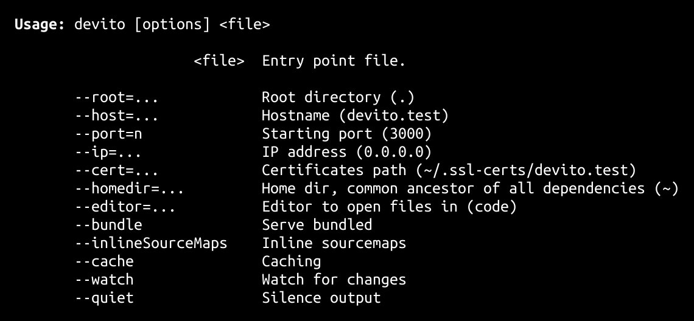

<h1>
devito <a href="https://npmjs.org/package/devito"></a> <a href="src"></a> <a href="LICENSE"></a>
</h1>

<p></p>

Fast http/2 web dev server

<h4>
<table><tr><td title="Triple click to select and copy paste">
<code>npm i devito -g</code>
</td><td title="Triple click to select and copy paste">
<code>pnpm add devito -g</code>
</td><td title="Triple click to select and copy paste">
<code>yarn global add devito</code>
</td></tr></table>
</h4>

## CLI

<p></p>
<p>

</p>

devito is a fast http/2 web dev server, inspired by [vite](https://vitejs.dev/).

It uses [swc](https://swc.rs/) and [esbuild](https://esbuild.github.io/).

```sh
devito my-file.tsx
```

The above will serve `my-file.tsx`. It will transform any dependency that is not an ESM module and will refresh on every change.

You will need a [`.swcrc`](https://swc.rs/docs/configuration/swcrc) file at the project's root for the transformations.

## API

<p>  <details id="DevitoOptions$4" title="Class" open><summary><span><a href="#DevitoOptions$4">#</a></span>  <code><strong>DevitoOptions</strong></code>    </summary>  <a href="src/devito.ts#L16">src/devito.ts#L16</a>  <ul>        <p>  <details id="constructor$5" title="Constructor" ><summary><span><a href="#constructor$5">#</a></span>  <code><strong>constructor</strong></code><em>()</em>    </summary>    <ul>    <p>  <details id="new DevitoOptions$6" title="ConstructorSignature" ><summary><span><a href="#new DevitoOptions$6">#</a></span>  <code><strong>new DevitoOptions</strong></code><em>()</em>    </summary>    <ul><p><a href="#DevitoOptions$4">DevitoOptions</a></p>        </ul></details></p>    </ul></details><details id="file$7" title="Property" ><summary><span><a href="#file$7">#</a></span>  <code><strong>file</strong></code>    </summary>  <a href="src/devito.ts#L17">src/devito.ts#L17</a>  <ul><p>string</p>        </ul></details><details id="port$9" title="Property" ><summary><span><a href="#port$9">#</a></span>  <code><strong>port</strong></code>  <span><span>&nbsp;=&nbsp;</span>  <code>3000</code></span>  </summary>  <a href="src/devito.ts#L19">src/devito.ts#L19</a>  <ul><p>number</p>        </ul></details><details id="root$8" title="Property" ><summary><span><a href="#root$8">#</a></span>  <code><strong>root</strong></code>  <span><span>&nbsp;=&nbsp;</span>  <code>'.'</code></span>  </summary>  <a href="src/devito.ts#L18">src/devito.ts#L18</a>  <ul><p>string</p>        </ul></details><details id="entryFile$12" title="Accessor" ><summary><span><a href="#entryFile$12">#</a></span>  <code><strong>entryFile</strong></code>    </summary>  <a href="src/devito.ts#L25">src/devito.ts#L25</a>  <ul>        </ul></details><details id="rootPath$10" title="Accessor" ><summary><span><a href="#rootPath$10">#</a></span>  <code><strong>rootPath</strong></code>    </summary>  <a href="src/devito.ts#L21">src/devito.ts#L21</a>  <ul>        </ul></details></p></ul></details><details id="devito$1" title="Function" open><summary><span><a href="#devito$1">#</a></span>  <code><strong>devito</strong></code><em>(options)</em>    </summary>  <a href="src/devito.ts#L30">src/devito.ts#L30</a>  <ul>    <p>    <details id="options$3" title="Parameter" ><summary><span><a href="#options$3">#</a></span>  <code><strong>options</strong></code>    </summary>    <ul><p><a href="#DevitoOptions$4">DevitoOptions</a></p>        </ul></details>  <p><strong>devito</strong><em>(options)</em>  &nbsp;=&gt;  <ul><span>Promise</span>&lt;void&gt;</ul></p></p>    </ul></details></p>

## Credits

- [@stagas/chalk](https://npmjs.org/package/@stagas/chalk) by [stagas](https://github.com/stagas) &ndash; Terminal string styling done right (+ CommonJS build)
- [@swc-node/core](https://npmjs.org/package/@swc-node/core) by [LongYinan](https://github.com/swc-project) &ndash; Faster swc nodejs binding
- [decarg](https://npmjs.org/package/decarg) by [stagas](https://github.com/stagas) &ndash; decorator based cli arguments parser
- [each-dep](https://npmjs.org/package/each-dep) by [stagas](https://github.com/stagas) &ndash; Async iterator walk of a file's dependencies.
- [esbuild](https://npmjs.org/package/esbuild) by [evanw](https://github.com/evanw) &ndash; An extremely fast JavaScript and CSS bundler and minifier.
- [event-toolkit](https://npmjs.org/package/event-toolkit) by [stagas](https://github.com/stagas) &ndash; Toolkit for DOM events.
- [everyday-node](https://npmjs.org/package/everyday-node) by [stagas](https://github.com/stagas) &ndash; Everyday node utilities.
- [everyday-utils](https://npmjs.org/package/everyday-utils) by [stagas](https://github.com/stagas) &ndash; Everyday utilities
- [find-free-ports](https://npmjs.org/package/find-free-ports) by [Sam Vervaeck](https://github.com/samvv) &ndash; Find multiple free ports on localhost
- [github-markdown-css](https://npmjs.org/package/github-markdown-css) by [Sindre Sorhus](https://sindresorhus.com) &ndash; The minimal amount of CSS to replicate the GitHub Markdown style
- [make-cert](https://npmjs.org/package/make-cert) by [Vinson Chuong](https://github.com/vinsonchuong) &ndash; Quickly generate a self-signed cert to start an HTTPS server
- [markdown-it](https://npmjs.org/package/markdown-it) by [markdown-it](https://github.com/markdown-it) &ndash; Markdown-it - modern pluggable markdown parser.
- [mime-types](https://npmjs.org/package/mime-types) by [jshttp](https://github.com/jshttp) &ndash; The ultimate javascript content-type utility.
- [qrcode-terminal](https://npmjs.org/package/qrcode-terminal) by [gtanner](https://github.com/gtanner) &ndash; QRCodes, in the terminal
- [running-at](https://npmjs.org/package/running-at) by [Maximilian Schiller](https://github.com/BetaHuhn) &ndash; Get local and network ip address
- [sse](https://npmjs.org/package/sse) by [Einar Otto Stangvik](http://2x.io)

## Contributing

[Fork](https://github.com/stagas/devito/fork) or [edit](https://github.dev/stagas/devito) and submit a PR.

All contributions are welcome!

## License

<a href="LICENSE">MIT</a> &copy; 2022 [stagas](https://github.com/stagas)
